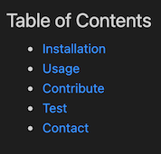
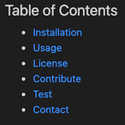

# Professional README Generator
## Description
A READme generator that takes advatange of node.js and inquirer technologies. This project is a command-line application that dynamically generates a professional README file from a user's input into a list of command line prompts by using the Inquirer package. (This README was generated using the application!)
## Table of Contents
- [Installation](#installation)
- [Usage](#usage)
- [Contribute](##contribute)
- [Test](##tests)
- [Contact](##questions?)

## Installation
To install necessary dependencies, run the following command within an integrated terminal for the index file:

    npm i
## Usage
To use, open an integrated terminal for the index.js file and run node index. This will begin the prompts for the READme generation. 
If no licenses are selected, the license section is excluded, as is the table of contents link for it as shown below. 

  

 Similarly, the final prompt asks the user if they plan on including image files for the top of the READme, within the Usage area of the README as a demo, or both. Selecting any or none of these options includes or excludes the respective assistive image linking templates for the user. 
 
 Note: the file created will use the project title to prepend the file name in case you are generating multiple READmes, and for clarity in moving the READme to its correct location. Do not forget to remove this preprend after moving your READme-- especially if you are using GitHub, as GitHub searches for a file with the simple name of "README.md" to display on repo websites.
### Demo

[Click for a video demonstrating the functionality in more detail](https://drive.google.com/file/d/1ZvbxLg1bM7OlixsJE4jXFacsPYuW-GtG/view?usp=sharing)

---

## Contribute
There are currently no contribution guidelines for this project. 
## Tests
To run tests, run the following command, and vary your responses:

    node index
## Questions?
If you come across any issues with the repo, please open an issue, or contact me directly at: anthonycastillo821@gmail.com. More of my work is avaiable on GitHub at [anth8nyc](https://github.com/anth8nyc/).
